# Table of Contents
- [LSWeather](#lsweather)
- [LSForecast](#lsforecast)
- [FavContacts](#favcontacts)
___

# LSWeather
A Scriptable script to add weather & calendar information on the lock screen. The script is meant to be called from Shortcuts app.
It is fully customizable script giving you access to change each data element on the lock screen. 
The script generates an overlay image which is embedded on top of a wallpaper.

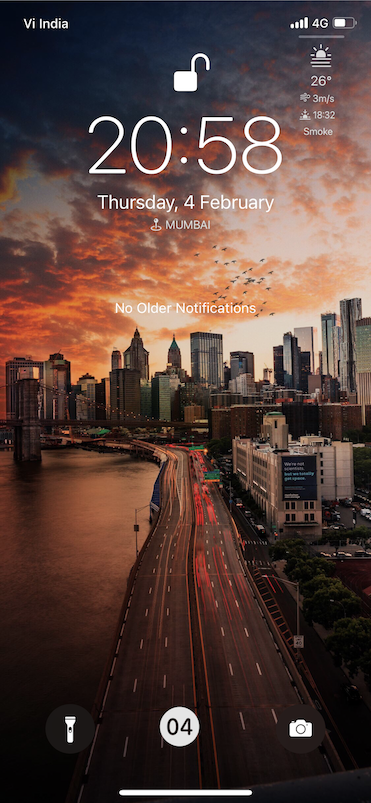 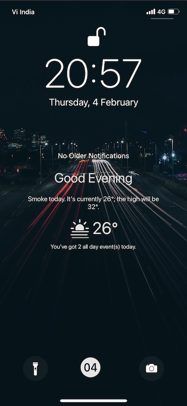
 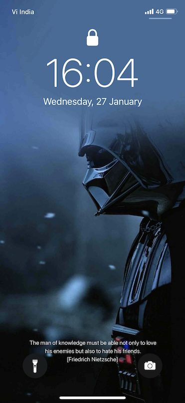
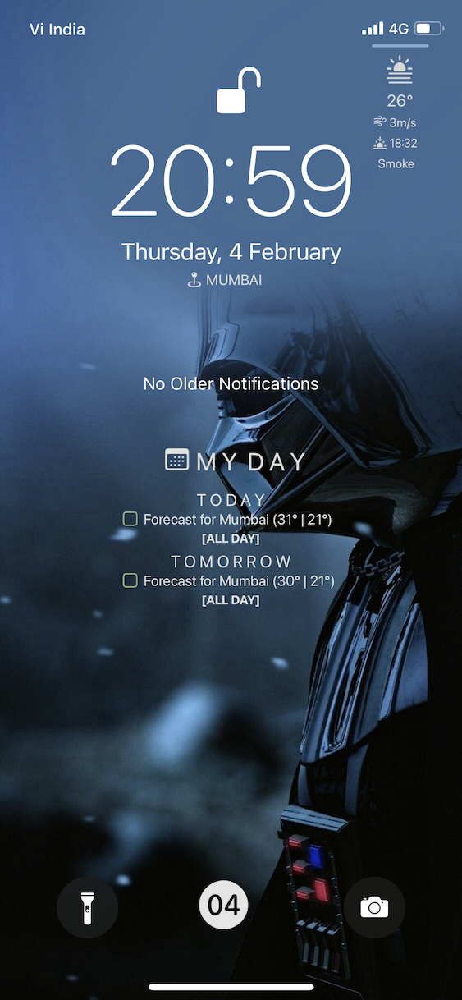 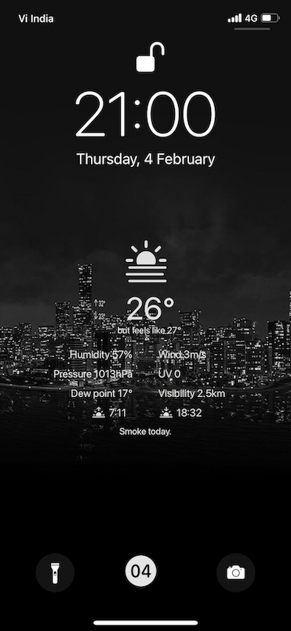

## Features
1. Shows weather, calendar and random quote on the lock screen.
1. Fully automated. Create Automations to run this script/shortcut every hour to get most recent information on your lock screen without manual intervention.
1. Choose from many pre-defined layouts or create your own layout.
1. Use custom SF symbols for weather icons.
1. Supports multiple calendars and configure 2 separate sections of calendars for *work* and *personal* events.
1. Marked ongoing events for better attention.
1. Fully customisable giving you control of each data element.
   - Easily create new data elements for any of the existing fields.
   - Write custom functions to return data in the format that you need.
1. Supports SF symbols as prefixes. 
   - Learn more about SFSymbols [here](https://developer.apple.com/sf-symbols/).
   - Check full list by downloading the macOS app from the above site or visit [sfsymbols.com](https://sfsymbols.com).
1. Run in *test* mode without calling various APIs
1. Compatible with almost all devices running iOS 14.4+. The Shortcut can handle any resolution wallpaper.

## Installation
1. Download and extract the content of this repository.
1. Download the script `LSWeather.js` to **Scriptable** folder in your iCloud Drive.
```
iCloud Drive/
├─ Scriptable/
│  ├─ LSWeather.js
```
1. Launch Scriptable and make sure that `LSWeather` is listed in the Scripts view.
1. Run the script to check if its working properly. A quicklook window with the default layout overlay will open.
1. Configure wallpapers. You can use either Photos Album or iCloud Folder to use as source of wallpapers
   - Photos Album
     - Create an Album in Photos with name **LSWeather**.
     - Add *some* wallpapers to this Album.
     - Shortcut will automatically pick up a wallpaper at random from this album.
   - iCloud Folder
     - Create a folder in iCloud -> Shortcuts with the name **LSWeather**.
     - Add *some* wallpapers to this folder.
     - Shortcut will automatically pick up a wallpaper at random from this folder.
1. Download and install this [shortcut](https://routinehub.co/shortcut/8282/).
1. Configure the shortcut as mentioned below.
1. Run the shortcut.

## Shortcut Configuration
1. Open the shortcut in Shortcuts app. 
1. Set the dictionary key value `layout` to one of the predefined values `'welcome'`, `'minimalWeather'`, `'feelMotivated'`, `'minimalCalendar'`, `'showMyWork'` and `'maximalWeather'`.
1. Set the dictionary key value `apiKey` to your openWeather API key.
   - Note: if `layout` and `apiKey` are not passed from Shortcuts app, it should be defined in the LSWeather script.
1. You can use either Photos Album or iCloud Folder to pick wallpapers for this script. To change that, look for the dictionary with `Photos` and `iCloud` boolean values and set either of them to `true`. Default is Photos.

## Script Configuration
1. OpenWeather API
   - Open the script in the Scriptable editor and add your openweather API key at `const WEATHER_API_KEY = `
   - Get your own API key for free [here](https://home.openweathermap.org/api_keys). Account is needed.
   - Note: Value passed from Shortcuts app will over-ride the API key value set in the script.

1. Template
   - Set `LAYOUT` to one of the predefined values `'welcome'`, `'minimalWeather'`, `'feelMotivated'`, `'minimalCalendar'`, `'showMyWork'` and `'maximalWeather'`.
   - Or use your customer layout by setting `LAYOUT = 'custom'`.
   - Note: Value passed from Shortcuts app will over-ride values set in the script.
   
1. Configure Weather Details
   - To show/hide weather details set `WEATHER_SHOW_WEATHER` to `true` or `false`. Hiding weather details will not call the openweather API.
   - To change weather units set `WEATHER_UNITS`. Default is `metric`.
   - To change locale/language set `WEATHER_LANG`. Default is `en`.
   - You can get valid values of `WEATHER_UNITS` & `WEATHER_LANG` [here](https://openweathermap.org/api/one-call-api).

1. Configure Calendar Details
   - To show/hide calendar details set `CALENDAR_SHOW_CALENDARS` to `true` or `false`.
   - To show/hide all day events set `CALENDAR_SHOW_ALL_DAY_EVENTS` to `true` or `false`.
   - To show/hide tomorrow events set `CALENDAR_SHOW_TOMORROW_EVENTS` to `true` or `false`.
   - Set-up personal calendars to be displayed with `CALENDAR_PERSONAL_CALENDARS`.
     - Ex. `const CALENDAR_PERSONAL_CALENDARS = ['Gmail','Football'];`.
     - If this variable is empty (`[]`), script will automatically fetch the default calendar for iOS.
   - Set-up work calendars to be displayed with `CALENDAR_WORK_CALENDARS`.
     - Ex. `const CALENDAR_WORK_CALENDARS = ['Work'];`.
     - If this variable is empty (`[]`), script will not display anything. In this case also set `hide` value to 1 for the layout item `workText` (See details below).
   - Maximum personal events to show set `CALENDAR_PERSONAL_MAX_EVENTS`.
   - Maximum work events to show set `CALENDAR_WORK_MAX_EVENTS`.
   - Set-up colors for different calendars with variable `CALENDAR_COLORS`.
   - To turn on/off calendar colors set `CALENDAR_SHOW_COLORS` to `true` or `false`.

1. Configure Quote Details
   - To show/hide quotes set `QUOTE_SHOW_QUOTES` to `true` or `false`. Hiding quotes details will not call the API.
   - Change quote tags with `QUOTE_TAGS` to get quotes for specific categories.
     - Ex. `const QUOTE_TAGS=['wisdom','friendship'].
     - Leave blank to get random quote across all categories.
     - You can get list of all valid tags [here](https://api.quotable.io/tags).
   - To change maximum length of quotes to be fetched set `QUOTE_MAX_LENGTH`.
   - To change quotes wrap length set `QUOTE_WRAP_LENGTH`. 

1. Configure Update Notification
   - Whenever an update is available on GitHub, a red update notification will appear on the top right corner. 
   - You can configure the number of days the script should look for an update by setting `UPDATE_CHECK_DAYS`.
   - Set above value to 0 to stop looking for updates (not recommended).

1. To show/hide last wallpaper updated time set `SHOW_LAST_UPDATED_TIME` to `true` or `false`.

1. To test the script without calling the openweather & quotable APIs set `TESTING` to `true`.

1. To change the layout of the data elements update dictionary `layouts`. Checking items which you can change easily to play around with the layout.
   - [ ] source: Source of the data. Valid values are "weather", "calendar", "quote", "text" & "function". 
         When using "function", the key should be the function name and function should return the string to be displayed.
         When using "text", the key should be the text to be displayed.
   - [ ] key: JSON key returned by functions fetchWeather(), fetchCalendar(), fetchQuote(). When the source is "text", key will be displayed as data.
   - [x] prefix: If present, will be prefixed to the data. SFSymbols are allowed in prefix. Use "SFSymbol|symbolName".
   - [x] suffix: If present, will be suffixed to the data. Use "temperature" for temperature data and "speed" for wind data, any other string accepted.
   - [x] x: x co-ordinate of the data element. Valid values are "left_margin", "right_margin", "center" and numbers. You can use relative co-ordinates like "center + 100". 
         Use -ve values to start from right margin i.e -50 will place the element at 50 pixels from the right margin.
   - [x] y: y co-ordinate of the data element. Valid values are "top_margin", "bottom_margin", "center" and numbers. You can use relative co-ordinates like "center + 100". 
   - [x] w: Width of the data element. Valid values are "half", "full" and numbers. You can use relative width like "half - 100".
   - [x] h: Height of the data element. Valid values are "half", "full" and numbers. You can use relative height like "half - 100".
   - [x] font: Font for the data element. Valid values are Font type objects. Predefined fonts are "ultraSmall", "extraSmall", "small", "medium", "large", "veryLarge", "extraLarge", "big" and "veryBig".
   - [x] color: Color for the data element (except icon). Valid values are "light", "dark" or hex code of the color. If null, white will be used.
   - [x] align: Alignment of the data element within the data rectangle. Valid values are "left", "right" or "center".
   - [x] hide: 0 or null to show this data element, 1 to hide, 2 for sunrise/sunset only (to show only 1 of them based on the time of the day).
   - [x] bold: make text bold. Valid values are true or false.

1. Logging
   - To generate logs in the iCloud drive when script is run through shortcut set `LOG_TO_FILE` to `true`. Only set this to true to debug an issue.
   - Check script logs in **LSWeatherLogs** folder in iCloud/Scriptable (logs are only saved to file when the script is run from Shortcuts, else logs are displayed on the console).

## APIs Used

1. OpenWeather API - [https://openweathermap.org](https://openweathermap.org).
1. Quotable API - [https://github.com/lukePeavey/quotable](https://github.com/lukePeavey/quotable).

## Credits

Below widgets/scripts have helped while coding for this script.

1. [Futcal for Scriptable](https://github.com/thejosejorge/futcal-for-scriptable).
1. [Terminal Widget](https://github.com/yaylinda/scriptable).
1. [termiWidget](https://gist.github.com/spencerwooo/7955aefc4ffa5bc8ae7c83d85d05e7a4).
1. Thanks to user [schl3ck](https://talk.automators.fm/u/schl3ck) for the code to tint SF symbols in drawContext which is currently not possible in Scriptable.

## Known Issues

1. The API quotable is sometimes slow and doesn't respond on time. You can set `const QUOTE_SHOW_QUOTES = 'false'` to stop using this API if you are facing this problem.

___

# LSForecast
A Scriptable script to add weather forecast to your lock screen. The script is meant to be called from Shortcuts app.
The script generates an overlay image which is embedded on top of a wallpaper.

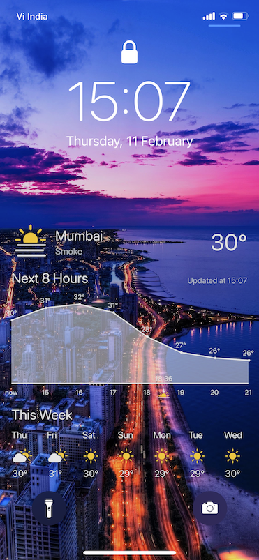 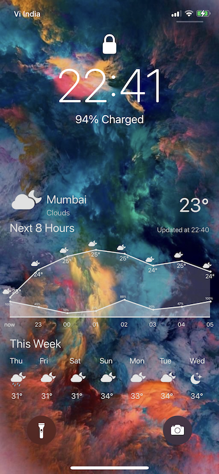

## Installation
1. Download and extract the content of this repository.
1. Download the script `LSForecast.js` to **Scriptable** folder in your iCloud Drive.
```
iCloud Drive/
├─ Scriptable/
│  ├─ LSForecast.js
```
1. Launch Scriptable and make sure that `LSForecast` is listed in the Scripts view.
1. Run the script to check if its working properly. A quicklook window with the default layout overlay will open.
1. Configure wallpapers. You can use either Photos Album or iCloud Folder to use as source of wallpapers
   - Photos Album
     - Create an Album in Photos with name **LSForecast**.
     - Add *some* wallpapers to this Album.
     - Shortcut will automatically pick up a wallpaper at random from this album.
   - iCloud Folder
     - Create a folder in iCloud -> Shortcuts with the name **LSForecast**.
     - Add *some* wallpapers to this folder.
     - Shortcut will automatically pick up a wallpaper at random from this folder.
1. Download and install this [shortcut](https://routinehub.co/shortcut/8378/).
1. Configure the shortcut as mentioned below.
1. Run the shortcut.

## Shortcut Configuration

1. Open the shortcut in Shortcuts app. 
1. Set the dictionary key value `accent` to hexadecimal color code e.g. #FF00FF.
1. Set the dictionary key value `alpha` to set the transparency of the graph. 0 is for fully transparent. 1 is opaque.
1. Set the dictionary key value `apiKey` to your openWeather API key.
   - Note: if `apiKey` is not passed from Shortcuts app, it should be defined in the LSForecast script.
1. You can use either Photos Album or iCloud Folder to pick wallpapers for this script. To change that, look for the dictionary with `Photos` and `iCloud` boolean values and set either of them to `true`. Default is Photos.

## Script Configuration

1. To show/hide weather icons for hourly forecast set `WEATHER_SHOW_HOURLY_ICONS` to either `true` or `false`
1. To show/hide POP (probability of precipitation graph) hourly forecast set `WEATHER_SHOW_POP_GRAPH` to either `true` or `false`
1. To show/hide POP values set `WEATHER_SHOW_POP_VALUES` to either `true` or `false`
1. To show/hide POP graph when POP data is not available (i.e. 0), set `WEATHER_SHOW_ZERO_POP_VALUES` to either `true` or `false`
1. To test the script without calling the openweather set `TESTING` to `true`.
1. To generate logs when script is run through shortcut set `LOG_TO_FILE` to `true`. Only set this to true to debug an issue.
1. Check script logs in **LSForecastLogs** folder in iCloud/Scriptable (logs are only saved to file when the script is run from Shortcuts, else logs are displayed on the console).

## Languages Supported
1. English (en), Portuguese (pt), Spanish (es), French (fr), German (de), Hindi (hi).
   - Translations are done using google translate so might not be accurated.
1. Raise an issue in GitHub or email me at <ajatkj@yahoo.co.in> to fix a translation issue or add translation for new language.

## APIs Used

1. OpenWeather API - [https://openweathermap.org](https://openweathermap.org).

___

# FavContacts
A Scriptable Favourite Contact's widget to quickly call, message, facetime & more your favourite contacts.
Widgets are available in all 3 sizes.

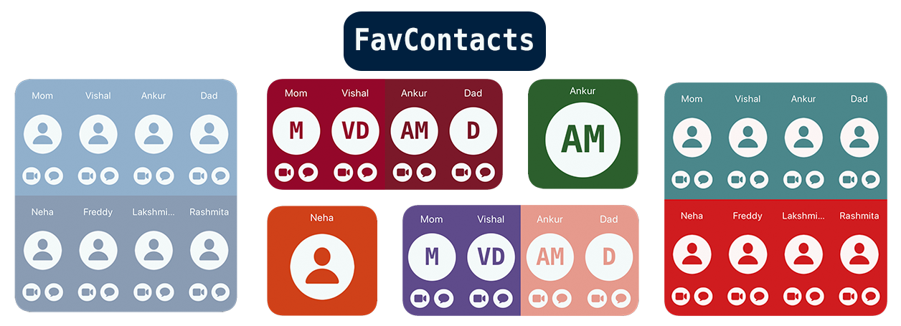

## Installation
1. Download and extract the content of this repository.
1. Download the script `FavContacts.js` to **Scriptable** folder in your iCloud Drive.
```
iCloud Drive/
├─ Scriptable/
│  ├─ FavContacts.js
```
1. Launch Scriptable and make sure that `FavContacts` is listed in the Scripts view.
1. Run the script to check if its working properly. A quicklook widget with the default settings will open.

## Features
1. Call, message, facetime, mail, whatsapp, telegram your favourite people directly from home screen.
1. You can set up-to 4 actions (including the default action to call when you click on the avatar).
1. Easily configure different avatar styles and quick actions.
1. Nearly 40 awesome color themes to chose from.
Note: Due to iOS restrictions, any action on Widget will first call scriptable app and then call the respective action. 

## Set-up Favourties
There are 3 ways to set-up favourite contacts list. Listing them here in order of preference.
1. Favourites Group: Create a group name "Favourites" in Contacts app via iCloud or any other app or sync service which provides it. Add contacts to this group.
1. If you cannot do option 1, you can "mark" individual contacts to be picked up by this script using following method-
   - Go to the contact you want to mark favourite, click on **Edit**
   - Scroll down and click on the **+** sign next to **add social profile**
   - Click on the default profile name and scroll down to the bottom and click on **Add Custom Service**
   - Give the service name as **Scriptable** and Social Profile as **Scriptable** as shown below.
   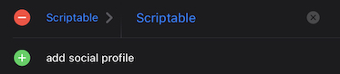
   - Click on Done.
1. You can also provide contact names in the script manually. This is not recommended as it will get over-written everytime you update the script.
```
let allcontacts = [
    {firstname: 'Firstname', lastname: 'Lastname'},
    {firstnmae: 'Another', lastname: 'Contact'},
]
```
1. Run the script in-app to update the contacts cache which is used to show contacts on the widget.
1. **Note: You will need to run the script *in-app* everytime you make any changes to contact list using either of the 3 options above**

## Script Configuration

1. To show/hide contact names set `SHOW_NAMES` to either `true` or `false`.
1. Choose different avatar styles ("contact", "symbol" or "initials") by setting `AVATAR_STYLE`.
1. Choose from around 40 awesome themes by setting `THEME`. Refer themes section below.
1. Set array `ITEMS_TO_SHOW` to set quick actions. 
   Choose from "facetimeVideo", "facetimeAudio", "message", "email", "spark", "gmail", "outlook", "whatsapp", "telegram", "twitter", "tweetbot", "twitterrific".
   Supported apps are-
   - Messages
   - Facetime Audio/Video
   - Whatsapp
   - Telegram
   - Default mail client
   - Spark Mail
   - Google Mail (Gmail)
   - Outlook Mail
   - Twitter
   - Tweetbot
   - Twitterrific
   * Note: to use twitter quick action, set Social Profile for "Twitter" with users twitter handle.

   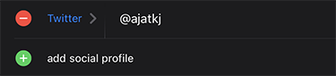

1. Set no. of quick action items to display using `NO_OF_ITEMS_TO_SHOW`. Minimum value 2, maximum 3. Set it to 0 to hide all actions.
1. For testing purpose you can use `SHOW_GUIDES` and `PREVIEW WIDGET` variables.
1. For minimal set-up, set `SHOW_NAMES` to `false` and `NO_OF_ITEMS_TO_SHOW` to `0`.


## Widget Configuration
1. Add multiple widgets by passing widget no. in widget arguments. 
   - No argument or widget no. 0 defaults to 1st widget
   `1`
1. Set-up different color themes for different widgets.
   `{"theme": "electricBlueAqua}`
1. Use different avatar style for different widgets.
   `{"avatar": "contact"}` or `{"avatar": "initials"}`
1. Combine one or more arguments above: Set-up widget no. 2 with theme *islandGreen* as-
   `2,{"theme": "islandGreen", "avatar": "initials"}`

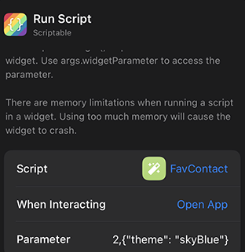

## Themes
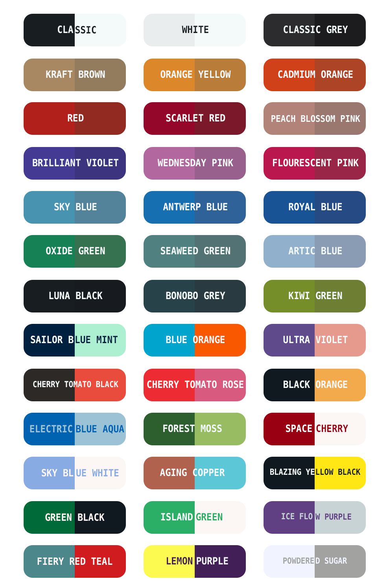

Theme names should be in *camelCase*. Ex. **Sailor Blue Mint** is **sailorBlueMint** and so on.

Note: Some themes are inspired by Moleskine Studio's Timepage app. Must download app!