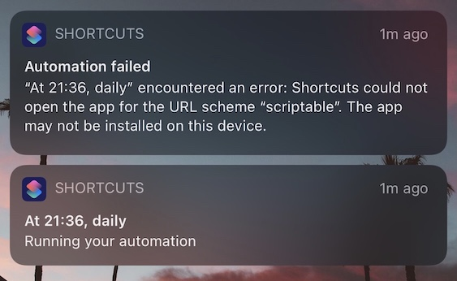

# LSWeather
A Scriptable script to add weather information on a wallpaper. The script is meant to be called from Shortcuts app.
It is fully customizable script giving you access to change each weather data element on the lockscreen.

## Installation
1. Download the script WeatherLS.js to **Scriptable** folder in your iCloud Drive
1. Open the script in the Scriptable editor and add your openweather API key at `const API_KEY = `
   - Get your own API key for free [here](https://home.openweathermap.org/api_keys). Account is needed.
1. Create an Album in Photos with name **WeatherLS**
1. Add some wallpapers to this Album
1. Download and install this [shortcut](https://www.icloud.com/shortcuts/174442993830452d8a5de27166d3b8bf)
1. Run the shortcut

## Script Configuration
1. If you want to test the script from Scriptable app i.e. without setting up the above shortcut
   - Create a folder **LSWallpapers** in iCloud/Scriptable
   - Copy a wallpaper file and rename it to **wallpaper.jpg**
   - The script will create a new wallpaper called **lswallpaper.jpg** in the same location

1. If you want to test the script without calling the openweather API
   - Open the script in the Scriptable editor and find the variable `TESTING`
   - Set this variable to `true` i.e. `const TESTING = true;`

1. You can change below parameters as per your requirement
   - Unit of temperature - look for the variable `UNITS` in the script.
   - Locale/Language - look for the variable `LANG` in the script.
   - You can get valid values of `UNITS` & `LANG` [here](https://openweathermap.org/api/one-call-api).

1. You can change the layout of the data elements by changing the dictionary `layouts`. Detailed explanation given in the script.

1. Check script logs in **LSWeatherLogs** folder in iCloud/Scriptable (logs are only saved to file when the script is run from Shortcuts, else logs are displayed on the console).

## Known Issues

1. Sometimes the script fails to complete and also doesn't throw an error. This could be a problem with particular wallpaper or due to insufficient memory. Run the shortcut again or try with different wallpaper.
1. While trying to run the shortcut in Automation it throws an error "Shortcuts could not open the app for the URL scheme \"scriptable\". The app may not be installed on this device.". 
This is either iOS bug or Scriptable bug. Due to this, the set-up cannot be completely automated. If anybody is able to figure it out, drop me an email. Would love to see this work.

